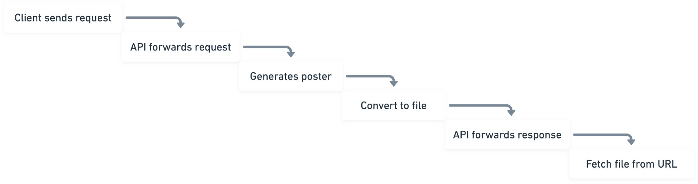
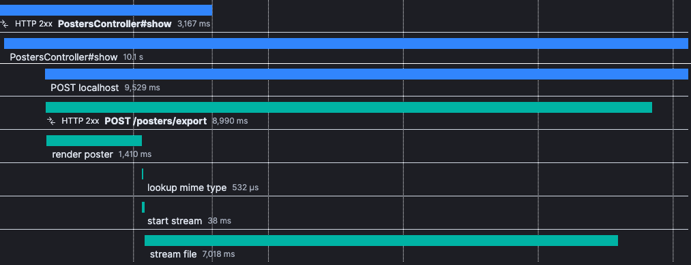

A system of distributed services can provide some benefits over monoliths and we
embrace the idea of small services at [Spurtli](https://www.spurtli.com). In
this article I’d like to bring attention to a performance problem that we
recently had in one of our projects and how we solved it. Inter-service
communication is hard, and it was even before microservices were a thing.
Lots of three-tier architectures suffer from the same problem as described
below, so this applies to monoliths too.

**tl;dr** Use streams to speedup inter-service data transfer.

## Change is in inevitable, so better embrace than fight it.

Most of the applications I had luck to work on over the last decade did not
follow any idiomatic design or architecture. Development of complex applications
is first and foremost an evolutionary process, and over time you just adopt
better patterns and you use better tools (as a developer and a team).

But first, we need to go back in history. About 10 years ago, on-premise content
management systems were _the thing_ and every company built some sort of media
asset pipeline into their system. Those systems either used a library or
command-line tool to fulfill transcoding tasks and most of the time those tools
were not written in any of the popular high-level programming languages used to
build the application (PHP, Ruby, Java …).

Whether you need to transcode an uploaded video file or resize an image to
generate a thumbnail for your website, the tools are not designed to be used by
web applications exclusively. They are usually maintained by another team, or
they are best case an Open Source project. It’s also likely that developing such
library on your own, will never pay off, even if you are a big shop and have
enough developers around.
Up until today many projects have been relying on libs such as
[GD](https://www.php.net/manual/en/book.image.php) for PHP which was supported
by many pre-cloud era webhosting firms. If you need something more powerful and
efficient, you have another choice with
[ImageMagick](https://imagemagick.org/index.php), and
[ffmpeg](https://ffmpeg.org/) is the heart and soul of a lot of media asset
pipelines that need to support video.

## Call a service by its command line interface

The easiest way to use any of the above mentioned programs and libs is by just
using their command line interface. but it is likely to cause problems once the
files are getting bigger. Though some people don’t consider those tools a
service, they do have some characteristics that clearly show that they are
services:

*   They have a defined contract
*   They are doing one particular thing
*   … and you know nothing about its internal processes

```
mogrify  -format gif -path thumbs -thumbnail 100x100 \*.jpg
```

The snippet above is an example from the ImageMagick website, but if you look
through the source of a (legacy) system, you might find a ton of similar CLI
instructions. It works perfectly fine, it transforms images and copies them into
a new directory. Also, most high-level programming languages and runtimes define
an API to handle (sub-)processes and process communication. For example, Ruby
has at least [5 different ways](https://stackoverflow.com/questions/6338908/ruby-difference-between-exec-system-and-x-or-backticks)
to execute a system program.
However, this also highlights a potential problem. If you have several options,
it’s hard to pick and use the right one. This might also be the reason why there
are so many _thin wrappers_, to simplify the usage of those programs. Just see
the list of [ffmpeg Rubygems](https://rubygems.org/search?utf8=%E2%9C%93&query=ffmpeg).

I strongly believe there is indeed a good way to use system programs. As long as
you rely on the foundations of the UNIX system, you likely use the program
exactly the way it was designed. Learning how to use _STDIN_ and _STDOUT_
properly and find a good way (even a lib) to handle flags and arguments is
nearly everything you need.
You might also want to take it one step further and think about using system
programs in the context of the _request/response_ loop. Whether you use a micro
framework or a full-blown MVC framework, its likely that you have some sort of
_parameters_ that define the behaviour of the request flow (e.g. query
parameters). It is considered a best practice to sanitize and validate input and
passing its values around our system afterwards (e.g. insert a row in your
relational database). The same pattern can be used to invoke a system program.

```ruby
def index
  output = `ffmpeg -i #{params[:file][:tempfile]}`

  respond_to do |format|
    format.mp4 { send_data(output) }
  end
end
```

Simple? Yes, and this contrived example might work for some cases, but it is
likely to cause problems once the files are getting bigger. This call is going
to capture the _STDOUT_ from the `ffmpeg` program and stores it in-memory (the
`output` variable).
It has another flaw, the process that handles the request of the app (in this
case it’s a Rails app) cannot be used for anything else as long as the
processing of the video file goes on. The commonly accepted best practice is to
keep request/response cycles as short as possible and to offload heavy tasks to
a worker queue. Though, in certain situations this is not an option, when you
absolutely need to create something on the fly. So, how do we handle this, you
might be wondering?

## Call another service over network

This is another, very popular, way of handling some work outside of your
(primary) application. In a complex system, different services fulfill different
roles. You might have a database, a cache or a search engine running behind the
scenes. Most of the time you communicate with those services over the network or
a similar concept (socket). This is what we usually call a
[backing service](https://12factor.net/backing-services). Nevertheless, the
world of microservices also requires communication between high-level services
or even between full apps.

At [www.spurtli.com](https://www.spurtli.com), we do have a few of those
services running. Most of them are just communicating with our public facing
GraphQL API. The web client, our poster generator, the internal dashboard, all
of our clients and apps use the same API. GraphQL allows us to define a clean
contract and through introspection, every client knows how to interact with it.
This is all pretty straightforward, but the actual workflows itself are not as
trivial.

Our app offers users to configure poster designs. The visuals created for the
poster are based on the individuals fitness data, which we sync from
[Strava](https://www.strava.com/) or uploaded
[FIT files](https://www.thisisant.com). Depending on the number of the current
user’s activities, the amount of data can become huge. The reason why we do this
on the server side is because we also offer **printed versions** of the
generated posters.

We still wanted to use D3, and even if it’s possible to invoke a JavaScript
runtime directly from Rails or Ruby, we decided to go for a more native solution
and decided to write the poster generator in pure JavaScript. Therefore, instead
of simply utilizing [D3.js](https://d3js.org/) in our web app, we created a new
[Node.js](https://nodejs.org/en/) service, the **poster generator**. The
requirements for the service itself were pretty simple:

*   It should be capable of accepting a bunch of user data and configuration
*   It should be accessible through a single RESTful endpoint `POST /posters`
*   It should be able to return the rendered poster in the requested file format

The most complex task was actually to implement nice designs for the posters
itself. For development purposes, we also created a slightly different _sandbox_
version of the generator, but the ideas for the production and the development
variant are pretty much the same.


One of the designs, rendered by the poster generator service

Nevertheless, after shipping this, we discovered that the poster editor does not
necessarily feel responsive all the time and we were forced to think about
potential improvements we can make. To help understand the problem, have a look
at the swimlane diagram.


Flow of data through the system

The major problem here is, that every step needs to wait for its previous step
to finish and also data needs to be transferred in-between steps. All of this
adds some time to the total round-trip time and even though it was not very
slow, there was still room for improvement.
For some of the steps we realised there was no potential to speed things up.
The initial request to the API, for example, is very fast. The proxy call to the
generator was also never a problem. And, this is really important, we do all the
data transfer within the local network.

Furthermore, some of the steps cannot be optimized from an architectural point
of view. We somehow have to run the D3 program to create a vector representation
of the poster, and we also have to fetch the complete data upfront from the
database. After the vector representation has been created, we still need to
transform it into the desired output format (PNG or PDF). For this step, we use
system program called `rsvg-convert`. This program is blazingly fast and is
capable of converting SVG files or strings into a binary representation.

## Solution

The best feature though, is the ability of `rsvg-convert` to do the work in
chunks and that it can provide an output stream instead of writing the result to
a file. After we have figured this out, we immediately thought about streams as
we knew that they are working great together with Node.js. Therefore we decided
to pass the output stream of the `rsvg-convert` program directly to the response
stream. Instead of waiting for the program to write the full output to a temp
file first, we can just skip this step and pipe it through.

Nevertheless, if you take a look at the diagram above, this improvement is only
half of the way to solve the full problem. In our API, we still had to wait for
the response to be completely served, before we could start to send the file to
the client.
Again, this problem can also be solved by using streams. Even though streams in
Ruby are not the most common thing.
So far, we were using an HTTP client called Faraday for service-to-service
communication. Besides being an awesome HTTP client, streams are not exactly its
strength. After some research, we found [_httrb_](https://github.com/httprb/http)
and besides supporting streams out of the box, it also comes with a nice
explanation on how to use [persistent connections](https://en.wikipedia.org/wiki/HTTP_persistent_connection).
We did not think about this at first, but after trying a few HTTP clients, we
realised that creating a new connection (with TLS) for each and every call to
the service is also quite expensive. We ended up using _httprb_ in conjunction
with [_connection\_pool_](https://github.com/mperham/connection_pool) to create
a pool of [thread-safe](https://github.com/httprb/http/wiki/Thread-Safety)
connections, which can be reused by all the requests we make to the poster
generator service.
To complete the cycle, we use Rails `LiveController` to also start pushing
chunks immediately to the client. As soon as the poster generator starts serving
chunks, this data is passed immediately to the client through our API.



Screenshot from our APM (Application Performance Monitoring)

This screenshot contains a diagram from our APM tooling and it shows the
data-flow during the development of this solution. The generator and the API
were set to debug mode, which adds a 1 sec delay between chunks sent to the
stream. The total round-trip in production is usually close to 100ms for a
preview file. You can see on the diagram, the span which says **stream file**
ends shortly before the API response itself is completed. Before _streams_, this
looked a lot like the swimlane diagram above.

## Summary

Our production system is now serving all posters as a stream of data. No matter
if they are intended to be used as a preview in the web editor or if files are
generated for printing. This is working great for us and we are really happy
with the solution.

There is obviously still some work that needs to be done and a few minor issues
pop up occasionally, but in general, shipping this to production was easy.
Recently, we even started thinking of more ways to use streams and we already
use streams to serve the React web app (Server-Side Rendering).

With streaming in place, the overall roundtrip time to create a poster file and
serving it to the client was reduced by about 30%.
